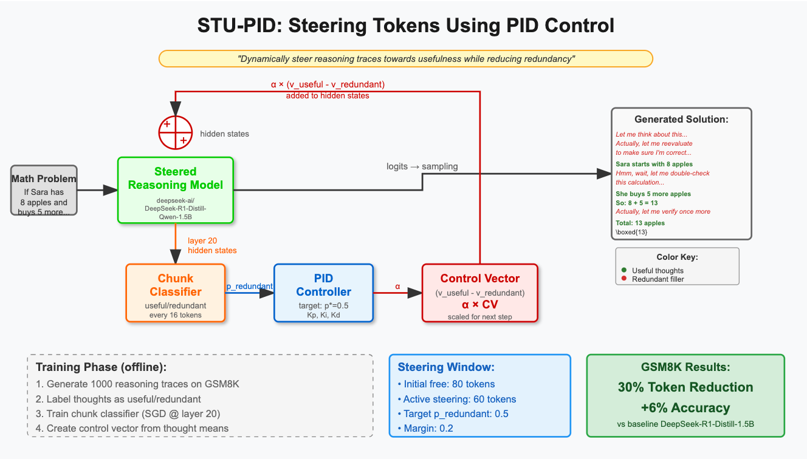

# STU-PID: Steering Tokens Using Proportional Integral Derivative Controller

## Overview

STU-PID is a novel approach for improving the efficiency of reasoning language models by dynamically steering their thought generation process. Using a PID (Proportional-Integral-Derivative) controller informed by a redundancy classifier, STU-PID reduces token usage by 30% while improving accuracy by 6% on GSM8K benchmark.

## How It Works

### 1. **Redundancy Classification**
- We train a classifier to distinguish between useful and redundant thoughts in reasoning traces
- The classifier operates on chunks of 16-24 tokens from hidden layer representations (layer 20)
- It outputs a probability score indicating how likely the current thought is redundant

### 2. **PID-Controlled Steering**
- The redundancy probability serves as the error signal for a PID controller
- Target redundancy is set to 50% (p* = 0.5) with a margin of 0.2
- The PID controller adjusts the steering strength (α) based on:
  - **Proportional (P)**: Immediate response to current redundancy level
  - **Integral (I)**: Accumulated error over time to eliminate steady-state bias
  - **Derivative (D)**: Rate of change to prevent overshooting

### 3. **Control Vector Application**
- A control vector is computed as the difference between mean useful and redundant thought embeddings
- The PID-adjusted steering strength (α) scales this control vector
- The scaled control vector is added to the model's hidden states, steering generation toward usefulness

## Key Features

- **Dynamic Adaptation**: Steering strength adjusts in real-time based on content quality
- **Windowed Operation**: 
  - First 80 tokens: Free generation without steering
  - Next 60 tokens: Active steering with PID control
  - Then deactivate to allow natural completion
- **Temperature Adjustment**: Generation temperature varies with steering strength for balanced output

## Results on GSM8K

Using DeepSeek-R1-Distill-Qwen-1.5B:
- **Token Reduction**: 30% fewer tokens generated
- **Accuracy Improvement**: +6% over baseline
- **Efficiency**: Maintains concise, focused reasoning while eliminating redundant phrases like "Let me reconsider..." or "Actually, wait..."

## Implementation Details

- **Model**: DeepSeek-R1-Distill-Qwen-1.5B
- **Embedding Layer**: 20
- **Chunk Sizes**: 16-24 tokens
- **PID Parameters**: Kp=0.05, Ki=0.001, Kd=0.001
- **Max Steering Strength**: 0.40
- **Temperature Range**: 0.30-0.60

## Training Process

1. Generate 1000 reasoning traces on GSM8K problems
2. Label each trace's thoughts as useful or redundant using LLM-based classification
3. Train SGD classifier on token chunks from labeled data
4. Create control vector from mean embeddings of useful vs redundant thoughts