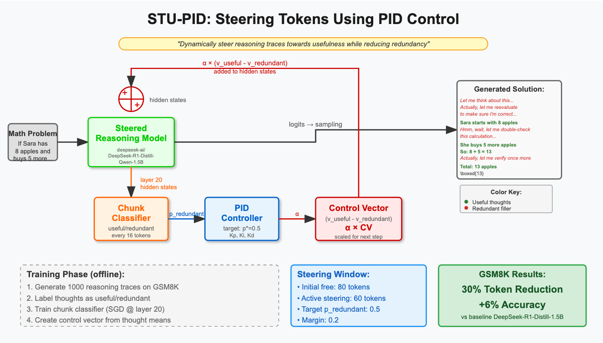

# Adaptive Activation Steering for Efficient LLM Reasoning via Closed-Loop PID Control

## Overview

A training-free, decoding-time method that reduces overthinking in reasoning
LLMs. A lightweight redundancy classifier scores each reasoning chunk, and a PID
controller turns that score into a per-chunk activation-steering strength. On a
77-problem GSM8K subset with DeepSeek-R1-Distill-Qwen-1.5B, it improves accuracy
from 85.7% to 89.6% (+3.9 pp) while cutting average output length from 1026 to
790 tokens (−23%).

The paper sources are in `paper_assets/` (`stupid.tex`, with all metrics and
hyperparameters generated into `numbers.tex` by `build_numbers.py` from the real
code and results, so they stay in sync).

## How it works

### 1. Redundancy classification
- A logistic-regression classifier distinguishes useful from redundant reasoning
  chunks.
- It operates on mean-pooled layer-20 hidden states over fixed-size chunks
  (16-24 tokens).
- It outputs a probability that the current chunk is redundant, which becomes the
  controller's feedback signal.

### 2. PID-controlled steering
- The redundancy probability minus a target (p* = 0.5, margin 0.2) is the error
  signal.
- The controller adjusts the steering strength alpha from three terms:
  - Proportional: immediate response to the current redundancy level.
  - Integral: accumulated error over time (clipped to prevent windup).
  - Derivative: rate of change, to damp overshoot.
- alpha is floored at 0, so the controller can only push away from redundancy.

### 3. Control vector application
- The steering vector is the difference between mean useful and mean redundant
  chunk embeddings (following SEAL's construction).
- The PID-adjusted alpha scales this vector, which is added to the residual
  stream at the chosen layer to steer generation away from redundancy.

## Control schedule
- First 80 tokens: free generation, no steering.
- Next 60 tokens: active steering under PID control.
- After the window: steering off, to allow natural completion.

The sampling temperature is coupled to the steering strength: it interpolates
from 0.60 with no steering down to 0.30 at full strength, so stronger
suppression is paired with more deterministic decoding.

## Results on GSM8K

DeepSeek-R1-Distill-Qwen-1.5B, 77-problem subset:

| Method                 | Accuracy | Avg. tokens |
|------------------------|----------|-------------|
| Baseline (no steering) | 85.7%    | 1026        |
| PID-steering           | 89.6%    | 790         |

That is +3.9 pp accuracy and −23% tokens over the baseline. Read it as a
small-scale proof of concept (one dataset, one 1.5B model), not a benchmark
result.

## Configuration
- Model: DeepSeek-R1-Distill-Qwen-1.5B
- Embedding layer: 20
- Chunk sizes: 16-24 tokens
- PID gains: Kp = 0.05, Ki = 0.001, Kd = 0.001
- Target redundancy p* = 0.5, margin = 0.2
- Max steering strength alpha_max = 0.40, integral clip I_max = 0.2
- Free period 80 tokens, steering window 60 tokens, max generation 4096 tokens
- Sampling temperature coupled to steering: 0.60 with no steering, falling to
  0.30 at full steering strength (interpolated by alpha / alpha_max)

## Training process
1. Generate reasoning traces on GSM8K problems.
2. Label each chunk as useful or redundant via LLM-based classification.
3. Train the SGD logistic classifier on token chunks from the labeled data.
4. Build the steering vector from mean embeddings of useful vs. redundant chunks.
